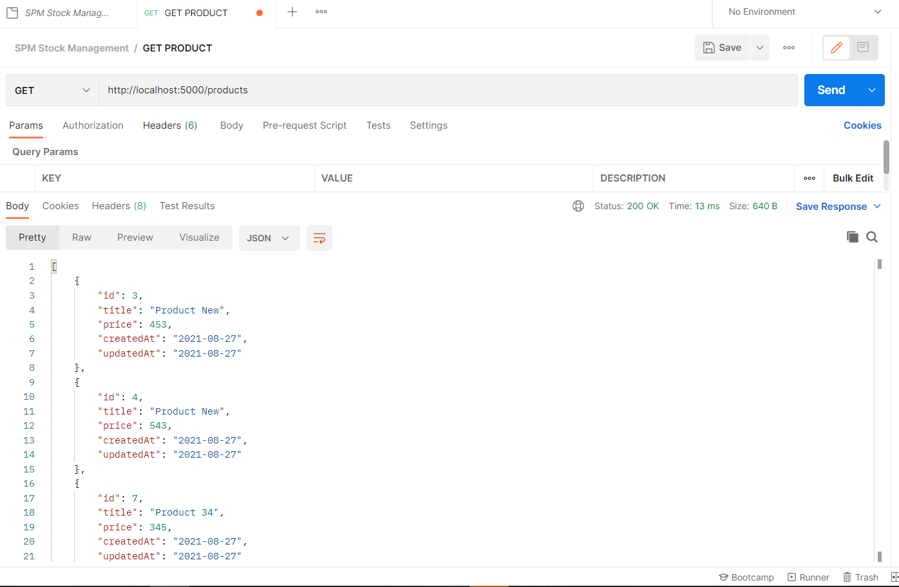
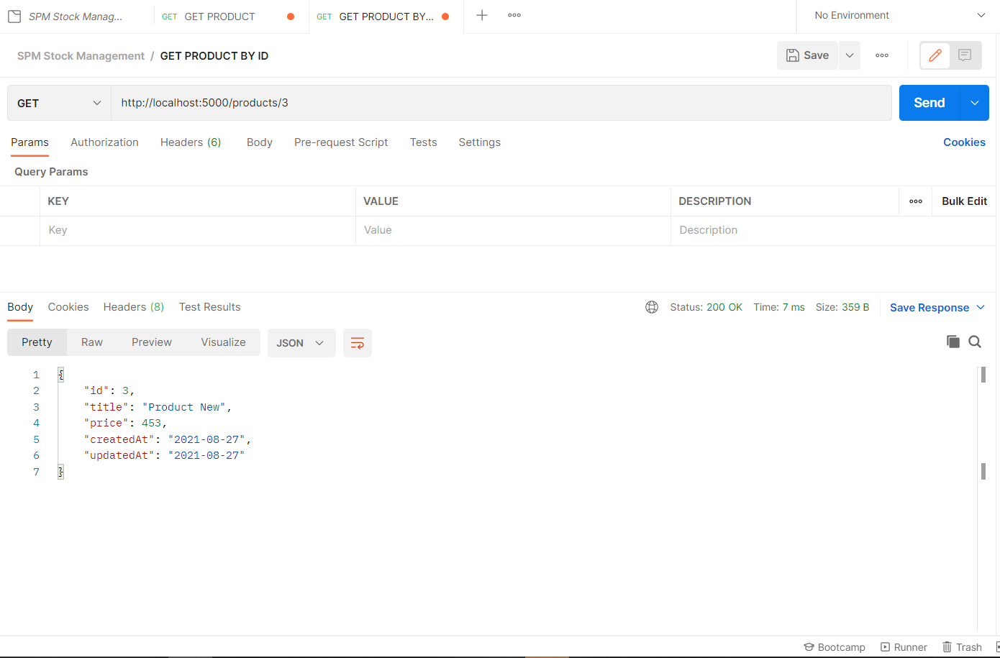
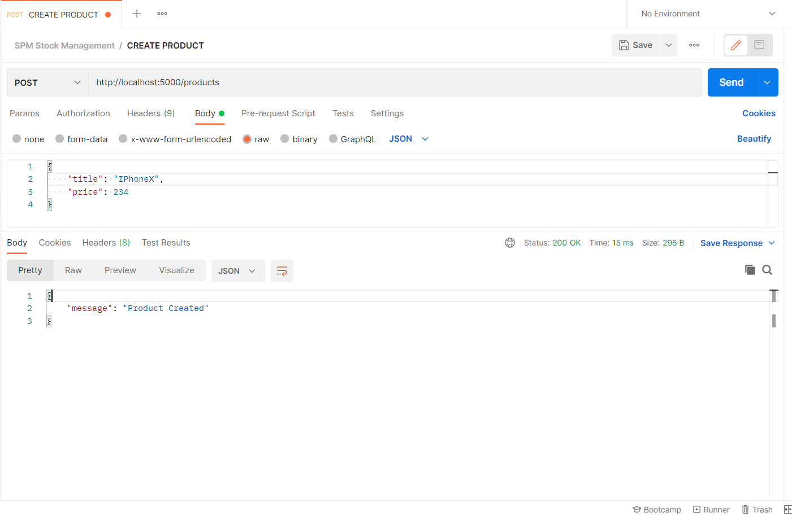
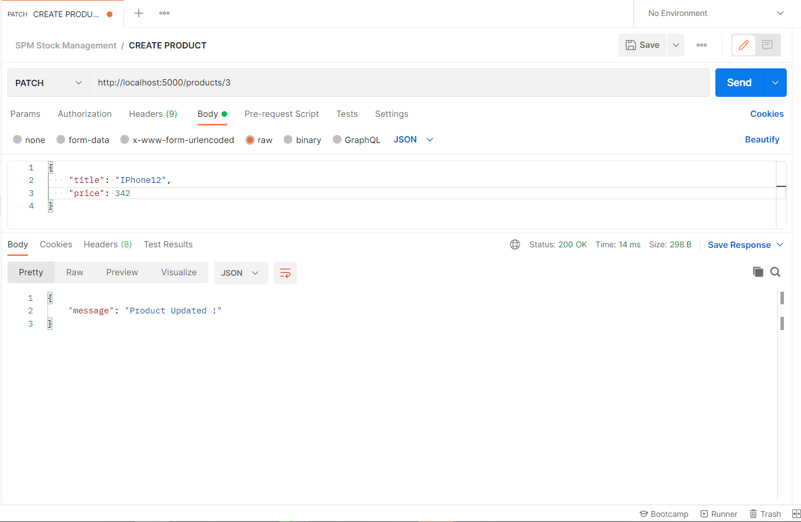

# :wave: Stock Management System!
 
This is a Full Stack app with React js and node js connected MySQL database .This database act as a real-time database ( Used background React js function to auto refreshing )

# 📒 The Technology Stack 
 1. React JS
 2. Node JS
 3. Express
 4. MySQL 

# 🔏  Trello

[Link]
[Screenshots]

1. Stock Management  Backend

2. Stock Management  Frontend

[Screenshots]

## 📚  Resources 
* [A short video explaining what GitHub is](https://www.youtube.com/watch?v=w3jLJU7DT5E&feature=youtu.be) 
* [Git and GitHub learning resources](https://docs.github.com/en/github/getting-started-with-github/git-and-github-learning-resources) 
* [Understanding the GitHub flow](https://guides.github.com/introduction/flow/)
* [How to use GitHub branches](https://www.youtube.com/watch?v=H5GJfcp3p4Q&feature=youtu.be)
* [Interactive Git training materials](https://githubtraining.github.io/training-manual/#/01_getting_ready_for_class)
* [GitHub's Learning Lab](https://lab.github.com/)
* [Education community forum](https://education.github.community/)
* [GitHub community forum](https://github.community/)
