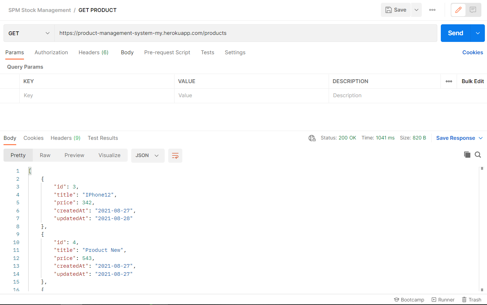
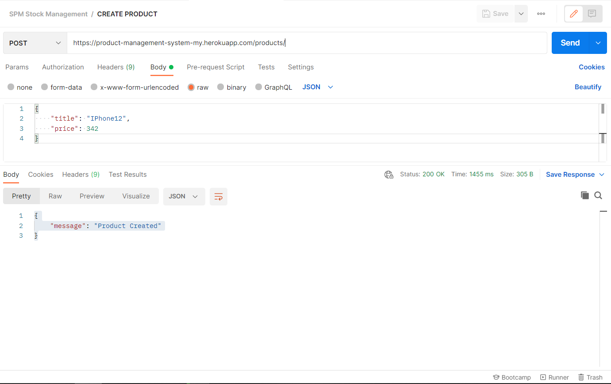
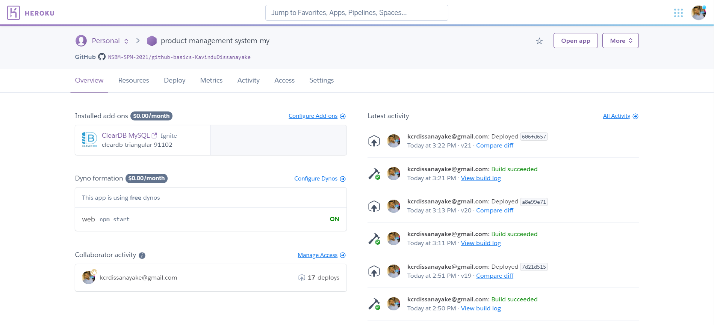

# :wave: Product Managment System

This is a Full Stack app with React js and node js connected MySQL database .This database act as a real-time database ( Used background React js function to auto refreshing )

# 📒 The Technology Stack 
 1. React JS
 2. Node JS
 3. Express
 4. MySQL 

# 🔏  Trello

[Link]
[Screenshots]

1. Product Management  Backend

*API

* Heroku dashboard

2. Product Management  Front END

Live LINK: [Link]
